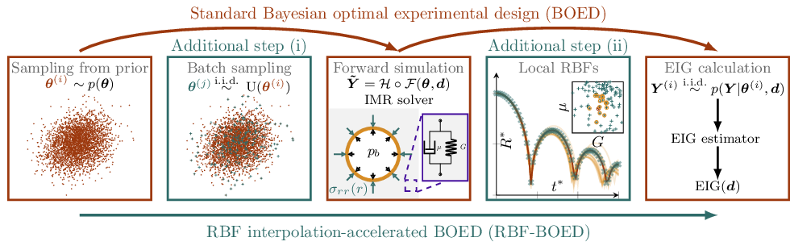

# IMR-based sequential BOED

A computational approach is developed to significantly improve the efficiency of Bayesian optimal experimental design (BOED) using local radial basis functions (RBFs). The Inertial Microcavitation Rheometry (IMR) approach is used to numerically solve the spherically symmetric motion of bubble dynamics. 
* The current version is based on the main-release repository, `IMR_v1`. For more details, see [here](https://github.com/InertialMicrocavitationRheometry/IMR_v1).

## Overview

   RBF--BOED accelerates the standard BOED process through two additional steps:
* Evaluate forward models for a small, uniformly sampled batch subset of prior parameters;
* Use local RBF interpolation to construct surrogates, leveraging nearby subsampled points to approximate responses at target parameters.

The approximated forward model across the entire prior distribution is used for the EIG computation.

## Summary of available constitutive models

| Model $\mathcal{M}$  | Description                | Material properties $\mathbf{\theta}_{\mathcal{M}}$  |
| ---:                 |     :---:                  |    :---                                              |
|                      | Newtonian Fluid            | $1/\mathrm{Re}$                                      |
| NHE                  | Neo-Hookean Elastic        | $1/\mathrm{Ca}$                                      |
| NHKV                 | Neo-Hookean Kelvin--Voigt  | $1/\mathrm{Re},1/\mathrm{Ca}$                        |
| SLS                  | Standard Linear Solid      | $1/\mathrm{Re},1/\mathrm{Ca},1/\mathrm{Ca_1}$        |
| SNS                  | Standard Non-Linear Solid  | $1/\mathrm{Re},1/\mathrm{Ca},1/\mathrm{Ca_1}$        |
| qKV (fung)           | Quadratic Law Kelvin--Voigt| $1/\mathrm{Re}, \alpha,1/\mathrm{Ca}_{\infty}$       |
| Gen. qKV             | Generalized qKV            | $1/\mathrm{Re},\alpha,1/\mathrm{Ca}_{\infty}$        |
| $\vdots$             | $\vdots$                   | $\vdots$                                             |

The current design approach supports all the constitutive models released in `IMR_v1`.

       
 ## Citation

Chu, T., Estrada, J. B., & Bryngelson, S. H. (2025). *Bayesian optimal design accelerates discovery of material properties from bubble dynamics.* Comput. Mech., 1-17. See [here](https://doi.org/10.1007/s00466-025-02606-4).
